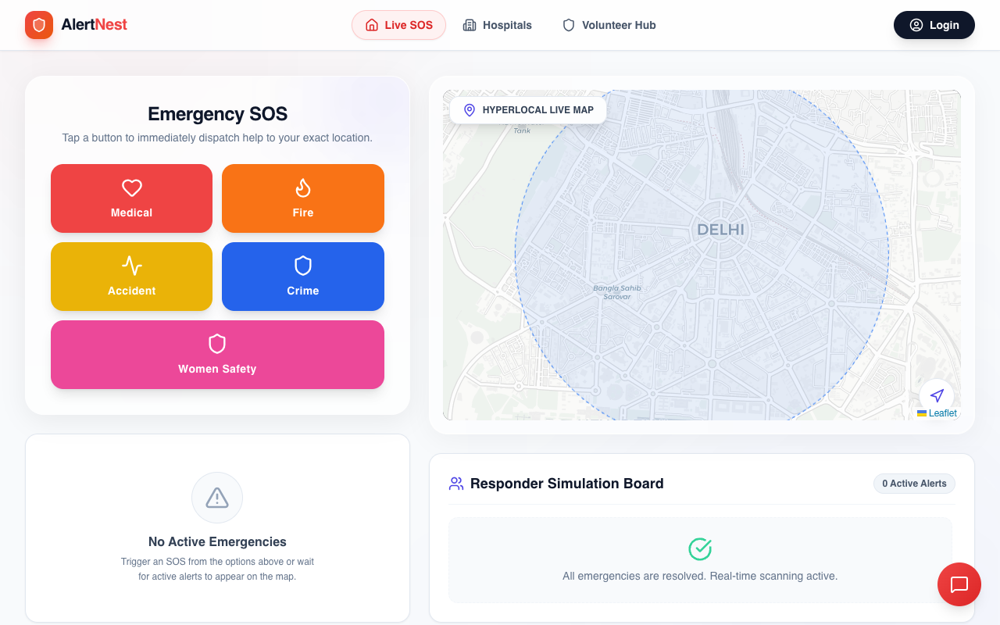
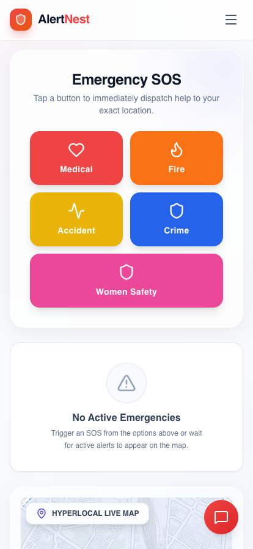
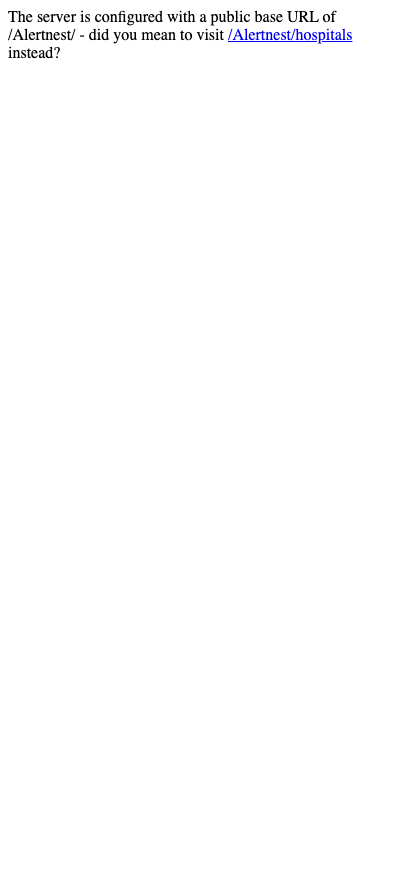

  

  # 🚨 AlertNest

  **A hyperlocal, AI-powered SOS platform designed to transform verified bystanders into first responders.**

  
  
  
  
  

---

## 📖 Overview

**AlertNest** severely reduces response times during the critical "golden hour" of emergencies. By instantly broadcasting SOS alerts to the nearest verified volunteers (off-duty doctors, nurses, and trained civilians), it effectively mitigates pre-hospital delays.

---

## 📸 Core Features & Interfaces

### 1. Victim SOS Interface

The primary one-tap SOS interface allows users in distress to instantly broadcast their live location and the type of emergency. This triggers the entire automated dispatch sequence and ensures help is on the way with zero delay.

### 2. Volunteer Live Map

A dedicated, live-updating dashboard for verified volunteers. It listens to Supabase Realtime channels to display active emergencies near them. The markers on the map use dynamic CSS (e.g., Pulsing Red for Medical) to visually indicate the threat level.

### 3. AI First-Aid Triage

Powered by Google Generative AI SDK, this interface provides immediate situational awareness. While waiting for the volunteer to arrive, the app streams crucial life-saving first-aid instructions directly to the victim or bystanders on the scene.

### 4. Intelligent Route Navigation

Once a volunteer accepts an SOS request, the app calculates the fastest physical street route (avoiding straight-line inaccuracies) using the OSRM API, guiding the responder swiftly to the victim's exact coordinates.

---

## 🛠️ Technology Stack

- **Frontend:** React 19, Vite, Tailwind CSS 4, Lucide React.
- **Mapping & Geolocation:** Leaflet.js, React-Leaflet, OSRM API.
- **Backend & Database:** Supabase (PostgreSQL), Supabase Realtime.
- **Artificial Intelligence:** Google Generative AI SDK, Groq SDK.

---

## 🏗️ System Architecture

1. **Event Trigger:** Victim presses the one-tap SOS button.
2. **Database Write:** A new `emergency_event` record is created in the database with `ST_Point` geospatial data.
3. **Real-time Broadcast:** An `INSERT` payload is emitted over WebSockets to all connected volunteer clients.
4. **Routing Calculation:** Volunteer's client calculates the fastest route to the victim.
5. **AI Invocation:** The victim's client simultaneously streams life-saving first-aid instructions.

---

  <i>We are ready to Build. Pitch. Win. Scale.</i> 
  <b>Built by Team Utkmizs (Utkarsh Mishra, Shashank Mishra)</b>

